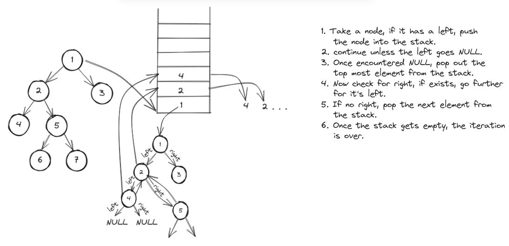

## In order traversal ~ Iterative Approach

--> In this approach, we'll need an auxillary stack space and the stack will hold the upcoming nodes.

**Approach :**

1. Take the node, if it's not NULL, push it into the stack.
2. If there exists a left, take it and push it to the stack.
3. If encounter a NULL, no need to move left any further.
4. Pop out the first element form the stack and print it.
5. As per the logic (left-root-right), we'll check for the right of current node.
6. If right is not NULL, check for further left.
7. If right is NULL, pop out the next element from the stack.
8. Once the stack gets empty, the iteration gets over.

---

**Example :**

```
          1
        /   \
       2     3
      / \
     4   5
        / \
       6   7
```

1. Take node 1 and push it into stack.

Stack becomes :

```
1
```

2. Node 2 is left of the node 1, push it into the stack. Node 4 is left of the node 2, so push it too.

Stack becomes :

```
4
2
1
```

3. Now, node 4 has a NULL left node, so pop out the node 4 from the stack.

Stack becomes :

```
2
1
```

4. Also node 4 has a NULL right node, so pop out the node 2 from the stack.

Stack becomes :

```
1
```

5. Now go to the right of node 2 and check for the left node, if exists, push it into the stack, if doesn't exist pop out the latest node from the stack.

---



---

### Implementation :

```cpp
/* Defination for binary tree :
struct TreeNode {
    int val;
    TreeNode *left;
    TreeNode *right;
    TreeNode() : val(x), left(nullptr), right(nullptr) {}
    TreeNode(int x): val(x), left(nullptr), right(nullptr) {}
    TreeNode(int x, TreeNode *left, TreeNode *right): val(x), left(left), right(right) {}
}
*/

class Solution {
public:
  vector<int> inorderTraversal(TreeNode* root){

    stack<TreeNode*> st; // declare a stack
    vector<int> ans; // declare an answer vector

    TreeNode* node = root; // take the root node

    while(true){
      if(node != NULL){ // if not null
        st.push(node); // push into the stack
        node = node->left; // go to left
      }
      else {
        if (st.empty() == true) break;
        node = st.top(); // if null,
        st.pop(); // pop the node out
        ans.push_back(node->val); // push it to ans vector
        node = node->right;  // now check for right
      }
    }
    return ans;
  }
};
```
